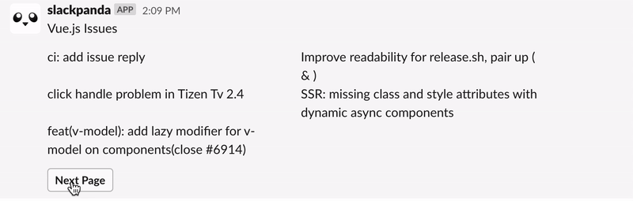

<div align="center">
  
</div>

<br />

<p>🤖 Vue3 for Slack Application 🐼</p>

<p>Slackpanda provides UI building experience same as web in the slack. If you know Vue3, You can use awesome reactivity system of vue 3.</p>

[](https://badge.fury.io/js/%40slackpanda%2Fcore)


## Setup

```bash
# via npm
$ npm install @slackpanda/vue @slackpanda/slack

# via yarn
$ yarn add @slackpanda/vue @slackpanda/slack
```

If you not have build command for .vue file, Recommend [vue3-node](https://github.com/Jungwoo-An/vue3-node) library.

```bash
# via npm
$ npm install vue3-node

# via yarn
$ yarn add vue3-node
```

## Getting Started

Create new slack app with slackpanda

```vue
// VueIssues.vue
<template>
  <pb-section text="Vue.js Issues" />
  <pb-section v-if="issues.length > 0">
    <pb-section-fields>
      <pb-text v-for="issue in issues" :key="issue.id">
        {{ issue.title }}
      </pb-text>
    </pb-section-fields>
  </pb-section>
  <pb-actions>
    <pb-button v-if="showsPrevButton" @click="onPrevButtonClicked">
      Prev Page
    </pb-button>
    <pb-button @click="onNextButtonClicked">Next Page</pb-button>
  </pb-actions>
</template>

<script lang="ts">
import { defineComponent, onMounted, ref, computed } from 'vue';
import axios from 'axios';
import {
  PbButton,
  PbSection,
  PbSectionFields,
  PbText,
  PbActions,
} from '@slackpanda/vue';

export default defineComponent({
  name: 'VueIssues',
  components: {
    PbSection,
    PbSectionFields,
    PbText,
    PbButton,
    PbActions,
  },
  setup() {
    const page = ref(1);

    const issues = ref<any[]>([]);

    const showsPrevButton = computed(() => page.value > 1);

    async function fetchData() {
      const response = await axios.get(
        `https://api.github.com/repos/vuejs/vue/issues?per_page=5&page=${page.value}`
      );

      issues.value = response.data;
    }

    function onNextButtonClicked() {
      page.value += 1;

      fetchData();
    }

    function onPrevButtonClicked() {
      page.value -= 1;

      fetchData();
    }

    onMounted(() => {
      fetchData();
    });

    return {
      issues,

      showsPrevButton,

      onNextButtonClicked,
      onPrevButtonClicked,
    };
  },
});
</script>
```

Create new client by calling function

```ts
const { createClient } = require('@slackpanda/vue');
const { SlackAdapter } = require('@slackpanda/slack');

const adapter = new SlackAdapter({
  apiToken: process.env.SLACK_API_TOKEN,
  signingSecret: process.env.SLACK_SIGNING_SECRET,
});

const client = createClient({
  adapter,
});
```

Send your slack app

```ts
const VueIssues = reuqire('./VueIssues.vue');

client.sendMessage(VueIssues, '#general');
```

Works fine!



## Feature Planning

- [ ] Test
- [ ] Friendly error report
- [ ] Home tabs
- [ ] CLI

## Documentation

- [Components](docs/components.md)
- [API](docs/api.md)
- [FAQ](docs/faq.md)

## Examples

- [VueIssues](examples/VueIssues) - Show issues of vue.js repository with pagination
- [TodoList](examples/TodoList) - ⏰ 🤖

## Supported Platforms and Frameworks

|                                                                                            | [Vue](packages/vue) | React |
| ------------------------------------------------------------------------------------------ | :-----------------: | :---: |
| [Slack](https://slack.com)                                                                 |         ✅          |  ❌   |
| [Discord](https://discord.com)                                                             |         ❌          |  ❌   |
| [Teams](https://www.microsoft.com/ko-kr/microsoft-365/microsoft-teams/group-chat-software) |         ❌          |  ❌   |
