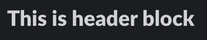
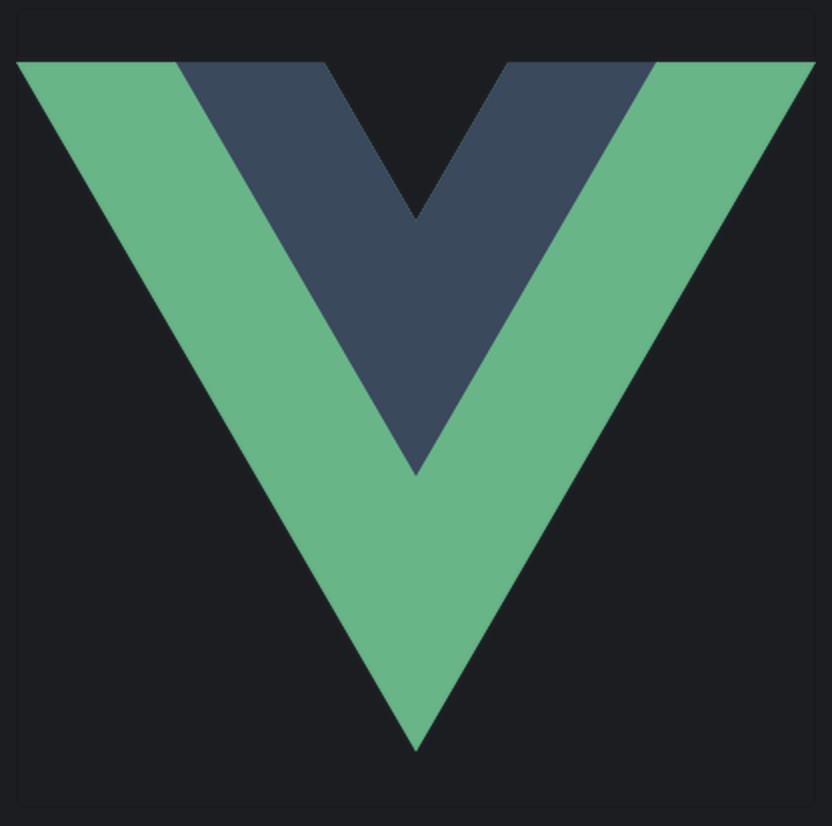
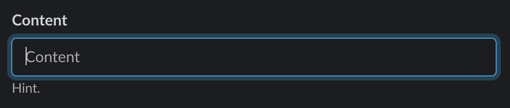
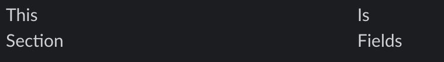
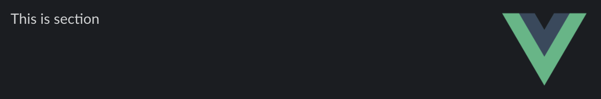
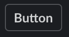
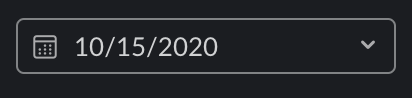
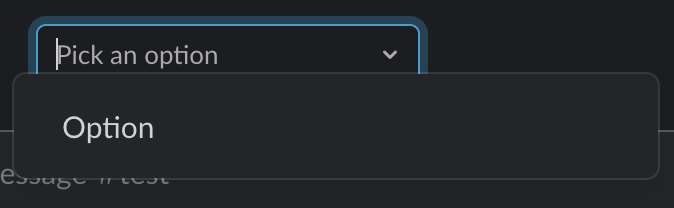

## Components

### `PbActions`

[See slack reference](https://api.slack.com/reference/block-kit/blocks#actions)

```html
<pb-actions>...</pb-actions>
```

### `PbContext`

[See slack reference](https://api.slack.com/reference/block-kit/blocks#context)

```html
<pb-context>...</pb-context>
```

### `PbDivider`

[See slack reference](https://api.slack.com/reference/block-kit/blocks#divider)

```html
<pb-divider />
```

### `PbHeader`

[See slack reference](https://api.slack.com/reference/block-kit/blocks#header)

```html
<pb-header>This is header block</pb-header>
```



### `PbImage`

[See slack reference](https://api.slack.com/reference/block-kit/blocks#image)

**Props**

| Name  | Type   | Required |
| ----- | ------ | -------- |
| `src` | string | Yes      |
| `alt` | string | Yes      |

**Example**

```html
<pb-image src="vue.png" alt="Logo" />
```



### `PbFormItem`

[See slack reference](https://api.slack.com/reference/block-kit/blocks#input)

**Props**

| Name       | Type    | Required | Default Value | Description                                                               |
| ---------- | ------- | -------- | ------------- | ------------------------------------------------------------------------- |
| `name`     | string  | Yes      |               | Unique identifier of form item. It's is like `<input name="">` in browser |
| `label`    | string  | Yes      |               | Title of form item                                                        |
| `required` | boolean | No       | false         |                                                                           |
| `hint`     | string  | No       |               |                                                                           |

**Example**

```html
<pb-form-item name="content" label="Content" hint="Hint" required>
  <pb-text-input placeholder="Content">
</pb-form-item>
```



### `PbSection`

[See slack reference](https://api.slack.com/reference/block-kit/blocks#section)

**Props**

| Name   | Type   | Required  | Description                                                  |
| ------ | ------ | --------- | ------------------------------------------------------------ |
| `text` | string | Preferred | This prop is not required if have section-fields in children |

**Example**

```html
<pb-section text="" />
```

### `PbSectionFields`

[See slack reference](https://api.slack.com/reference/block-kit/blocks#section_fields)

```html
<pb-section-fields>
  <pb-text>This</pb-text>
  <pb-text>Is</pb-text>
  <pb-text>Section</pb-text>
  <pb-text>Fields</pb-text>
</pb-section-fields>
```



### `PbSectionAccessory`

[See field named `accessory` of section](https://api.slack.com/reference/block-kit/blocks#section_fields)

```html
<pb-section text="This is section">
  <pb-section-accessory>
    <pb-image src="vue.png" alt="Logo" />
  </pb-section-accessory>
</pb-section>
```



### `PbButton`

[See slack reference](hhttps://api.slack.com/reference/block-kit/block-elements#button)

**Props**

| Name    | Type   | Required |
| ------- | ------ | -------- |
| `url`   | string | No       |
| `style` | string | No       |

**Events**

| Name    | Type                                             | Description           |
| ------- | ------------------------------------------------ | --------------------- |
| `click` | ({ trigger_id }: { trigger_id: string }) => void | Triggers when clicked |

**Example**

```html
<pb-button>Button</pb-button>
```



### `PbCheckboxGroup`

A group of PbCheckbox

**Warning**: PbCheckGroup can't update without uesr interaction

**Props**

| Name    | Type     | Required |
| ------- | -------- | -------- |
| `value` | string[] | Yes      |

**Example**

```html
<pb-checkbox-group :value="['option1']">
  <pb-checkbox value="option1"></pb-checkbox>
</pb-checkbox-group>
```

### `PbCheckbox`

[See slack reference](https://api.slack.com/reference/block-kit/composition-objects#option)

**Props**

| Name          | Type   | Required |
| ------------- | ------ | -------- |
| `value`       | string | Yes      |
| `description` | string | No       |
| `url`         | string | No       |

**Example**

```html
<pb-checkbox value="value">Checkbox</pb-checkbox>
```

### `PbRadioGroup`

A group of PbRadioButton

**Warning**: PbRadioGroup can't update without uesr interaction

**Props**

| Name    | Type   | Required |
| ------- | ------ | -------- |
| `value` | string | Yes      |

**Example**

```html
<pb-radio-group :value="['option1']">
  <pb-radio-button value="option1"></pb-radio-button>
</pb-radio-group>
```

### `PbRadioButton`

[See slack reference](https://api.slack.com/reference/block-kit/composition-objects#option)

**Props**

| Name          | Type   | Required |
| ------------- | ------ | -------- |
| `value`       | string | Yes      |
| `description` | string | No       |
| `url`         | string | No       |

**Example**

```html
<pb-radio-button value="value">Radio</pb-radio-button>
```

### `PbDatePicker`

[See slack reference](https://api.slack.com/reference/block-kit/block-elements#datepicker)

**Props**

| Name          | Type   | Required |
| ------------- | ------ | -------- |
| `placeholder` | string | Yes      |
| `value`       | string | No       |

**Events**

| Name    | Type                    | Description                 |
| ------- | ----------------------- | --------------------------- |
| `input` | (value: string) => void | Triggers when value changes |

**Example**

```html
<pb-date-picker value="2020-10-15" />
```



### `PbSelectMenu`

A PbSelectMenu allows user to select multiple items from a group of PbOption

**Props**

| Name          | Type                                                 | Required | Default Value |
| ------------- | ---------------------------------------------------- | -------- | ------------- |
| `type`        | 'static' or 'users' or 'conversations' or 'channels' | Yes      | static        |
| `placeholder` | string                                               | No       |               |
| `value`       | string                                               | No       |               |

**Events**

| Name    | Type                    | Description                 |
| ------- | ----------------------- | --------------------------- |
| `input` | (value: string) => void | Triggers when value changes |

**Example**

```html
<pb-select-menu type="static">
  <pb-option value="option1">Option</pb-option>
</pb-select-menu>
```



### `PbText`

A plain text component for PbSectionFields

**Example**

```html
<pb-text>Text</pb-text>
```

### `PbModal`

**Warning**: PbModal must be declared at the top level

[See slack reference](https://api.slack.com/surfaces/modals)

**Props**

| Name        | Type                                                     | Required | Description                                                                                              |
| ----------- | -------------------------------------------------------- | -------- | -------------------------------------------------------------------------------------------------------- |
| `title`     | string                                                   | Yes      |                                                                                                          |
| `submit`    | string                                                   | No       | Submit button text of modal                                                                              |
| `close`     | string                                                   | No       | Close button text of modal                                                                               |
| `triggerId` | string                                                   | Yes      | `triggerId` is unique id. it's generated when button clicked                                             |
| `open`      | boolean                                                  | No       | visibility of Modal                                                                                      |
| `onSubmit`  | (value: Record<name of PbFormItem, value of PbFormItem>) | No       | triggers when submit clicked. Parameter is values group of value of PbFormItem declared within the modal |

**Events**

| Name    | Type       | Description                 |
| ------- | ---------- | --------------------------- |
| `close` | () => void | Triggers when close clicked |

**Example**

```vue
<template>
  <pb-modal :trigger-id="triggerId" @close="handleClose"></pb-modal>
  <pb-button @click="handleOpen">Show Modal</pb-button>
</template>

<script>
export default defineComponent({
  components: {
    PbModal,
    PbButton,
  },
  setup() {
    const triggerId = ref(null);

    const open = ref(false);

    function handleOpen({ trigger_id }) {
      triggerId.value = trigger_id;
      open.value = true;
    }

    function handleClose() {
      triggerId.value = null;
      open.value = true;
    }

    return {
      handleOpen,
      handleClose,
    };
  },
});
</script>
```
